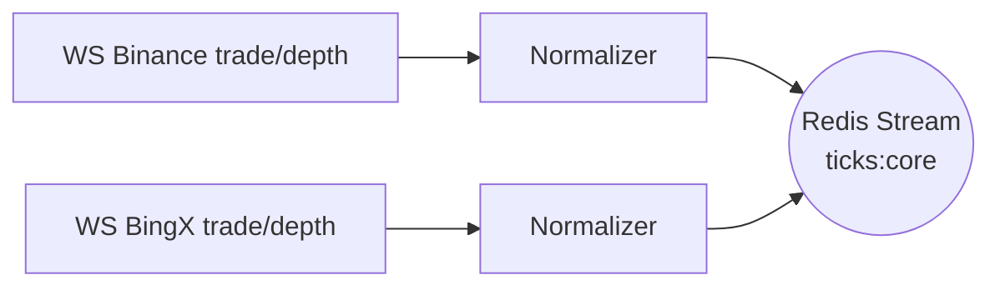

# 02 Data Bus

The Data Bus ingests raw market feeds (WebSocket) from Binance and BingX, normalises the messages, filters anomalies, and publishes them to Redis Streams.

## Architecture

## Module `src/core/data_bus.py`
* Connects to two WebSocket sources concurrently
* Converts all numeric fields to `float64`
* Converts timestamps to milliseconds
* Drops duplicate or outlier ticks (5σ heuristic)
* Publishes to `ticks:core` with capped length
See code for full implementation.
